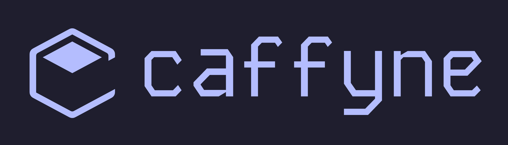

---

caffyne shell is a modern, GTK-based desktop shell built on top of Fabric, Python, and GTK. It features a highly customizable drag-and-drop panel, fluid animations, and deeply integrated system applets designed specifically for modern Wayland compositors.

---

## ✨ Features

* **Modern UI Architecture:** Built with native GTK widgets running smoothly on Wayland.
* **Dynamic Personalization:** Powered by *Matugen* to deliver seamless *Material You* color palettes derived dynamically from your wallpapers.
* **Interactive Control Hub:** 15 pre-built applets covering everything from process management to a quick settings panel.
* **Modular Bar Design:** A highly flexible, drag-and-drop bar structure optimized for flexibility.

---

## 🖥️ Supported Window Managers

While caffyne shell does not manage window configurations itself, it connects natively to the following Wayland compositors:

| Window Manager | Status    |
| -------------- | --------- |
| **Niri**       | 🟢 Stable |
| **Hyprland**   | 🧪 Beta   |
| **MangoWM**    | 🧪 Beta   |

---

## 🚀 Installation

### Quick Install (Arch Linux)
For a rapid deployment on Arch Linux, you can stream the setup script directly:

```bash
curl -fsSL [https://raw.githubusercontent.com/caffyne-org/caffyne-shell/main/install.sh](https://raw.githubusercontent.com/caffyne-org/caffyne-shell/main/install.sh) | bash
```

### Manual Installation
See our [Installation Documentation](https://caffyne.org/getting-started/installation) for a detailed step-by-step guide.

---

## ⚙️ Configuration & Autostart

To launch caffyne shell automatically when logging into your compositor session, add the helper script to your compositor configuration:

### Niri (`config.kdl`)
```ini
spawn-at-startup "~/.config/caffyne-shell/start.sh"
```

#### Standard Config (`hyprland.conf`)
```ini
exec-once = ~/.config/caffyne-shell/start.sh
```

#### Modern Lua Config (`hyprland.lua`)
```lua
-- Add this to your exec or startup table
hyprland.exec_once({ "~/.config/caffyne-shell/start.sh" })
```

---

## ⌨️ Controlling Applets (IPC Syntax)

caffyne shell delegates keyboard shortcut assignments to your host window manager. You can toggle applets smoothly via an Inter-Process Communication (IPC) layer using `fabric-cli`:

```ini
# Example: Niri keybindings to toggle widgets
Mod+Space { spawn "fabric-cli" "exec" "caffyne-shell" "bar_manager.toggle('Launcher')"; }
Mod+N     { spawn "fabric-cli" "exec" "caffyne-shell" "bar_manager.toggle('Notifications')"; }
```

### Available Applets
You can pass any of these identifier handles into `bar_manager.toggle('<Applet>')`:
* `Launcher`, `Settings`, `Notifications`, `Clock`, `Calendar`, `Weather`, `Media`, `Volume`, `Wifi`, `Bluetooth`, `Energy`, `Session`, `Calculator`, `Keyboard`, `Processes`.

---

## ❤️ Contributing & Credits

Contributions are always welcome! Please check the issues tab, follow our descriptive branching workflow, and submit a pull request. 

Special thanks to `@its-darsh` (Fabric framework), `@Axenide` (backend clients), `@linkfrg` (Ignis runtime inspiration), and `@amansxcalibur` (UI code snippets) for making this project possible.
